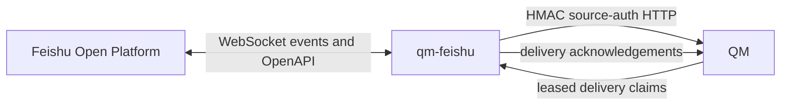

> 治理版本：2
> 事实状态：current-with-known-gaps
> 生命周期：active
> 实施状态：n/a
> SSOT 同步：synced
> 对应事实源：src/, test/, package.json, Dockerfile
> 替代关系：替代已归档的 2026-08-03 设计与实施计划中的当前事实
> 最后复核时间：2026-08-06

# Project architecture

## Product boundary

`qm-feishu` 是独立部署的 Feishu/Lark 消息 surface，通过 source-authenticated HTTP 连接 QM。它不导入、vendor、链接或修改 QM 源码；QM 持有 run、approval、delivery 和 blob 的权威状态。

当前支持：

- 私聊与显式 @ 机器人的群消息；
- reply/topic 上下文映射；
- 活跃 run 停止和普通 follow-up；
- 私聊输入附件与持久化输出附件；
- 可选的 principal 主动投递；
- 校验请求人的命令审批卡片；
- 入站 turn 和出站消息 part 的确定性幂等。

不支持：群历史、群附件、reaction、流式编辑、用户 token 代发、跨租户会话、Slack/Feishu 身份自动合并。

## Runtime model



启动入口为 `src/main.ts`；公开库入口 `src/index.ts` 只暴露 `startFeishuSurface` 和类型。运行时先启动 health server，再连接 QM、Feishu OpenAPI 和 WebSocket。`/healthz` 表示进程存活；`/readyz` 只有在 QM、Feishu API、WebSocket 和 delivery poll 均确认后才为 ready。

关闭时停止事件摄入、approval watcher 和新 delivery claim，并在配置的截止时间内等待已登记 poll/send 完成。未确认的 delivery 不 ack，租约到期后由 QM 重新开放。

## Module ownership

| Module | Owns | Must not own |
| --- | --- | --- |
| `src/qm/` | QM URL、HMAC 签名、HTTP 请求与 wire response 校验 | Feishu SDK 或 surface 决策 |
| `src/feishu/` | SDK/WebSocket、事件解码、OpenAPI 消息和资源传输、Feishu 错误分类 | QM workflow 状态 |
| `src/surface/` | intake 策略、thread/target grammar、approval 授权、delivery ack 决策 | HTTP 或 SDK concrete client |
| `src/runtime.ts` | 生命周期、依赖恢复、poll 调度、readiness 与 shutdown | 持久化业务状态 |
| `src/setup/` | Feishu 应用创建/接入和原子写入本地环境配置 | 运行时消息处理 |

隔离约束由 `test/isolation.test.ts` 和 CI 验证。

## Identity, thread, and target grammar

```text
principalId
  <feishu open_id>

threadRef
  feishu:dm:<chat_id>
  feishu:chat:<chat_id>:message:<root_message_id>

delivery target
  chat:<chat_id>:message:<root_message_id>
  user:<open_id>
```

私聊以 `chat_id` 形成连续 thread；群消息以 `root_id ?? message_id` 形成 reply root。入站 turn 使用 `feishu:message:<message_id>`；出站 part UUID 由 QM delivery idempotency key、part index 和 part kind 确定性派生。

## Trust boundaries

- 每个进程只接受一个 `FEISHU_TENANT_KEY` 和一个 `FEISHU_APP_ID`。
- Card callback 在访问 QM 前校验 callback tenant、operator tenant 和 app ID；授权以 QM 中持久化请求人的 `externalId` 为准。
- 远程 QM 必须使用 HTTPS；HTTP 只允许 loopback。
- 默认日志不记录消息正文、命令、文件内容、tenant 标识或 credential。
- principal delivery 默认关闭；同一 QM 部署只能有一个 principal delivery consumer。

安全披露与具体边界见仓库根目录 `SECURITY.md`。

## Compatibility ownership

`package.json#qmCompatibility` 是机器可读的 QM revision 声明；CI 固定到相同 commit，`compatibility.md` 是面向维护者的发布兼容事实。三者必须同步。QM HTTP 是观测契约，不是稳定 SDK。

## Known gaps

- 固定 QM revision `0f0e0ad` 的自动 source-auth contract 已纳入发布门禁；真实 Feishu 活跃 run follow-up 行为仍需按 release matrix 重新验证。此前 revision `7f2c916` 在带 per-message idempotency key 时会创建独立 run，而非 steer 原 run；adapter 保留 idempotency 以保证 replay safety。
- Rich-post 解码只保留有 `text` 字段的元素；图片、@ 等非文本元素不会进入 turn 文本。
- 长文本按 JavaScript UTF-16 code unit 分片；边界可能切开 surrogate pair。
- 群附件不会送达：应用只申请显式群 @ 权限，且 Feishu 附件消息不能携带 @；适配器不跨消息猜测归属。
- Delivery 和 approval 指标是进程局部值，不是 QM 全局队列统计。

发布兼容缺口与外部验证状态见 [Compatibility](compatibility.md) 和 [Release verification](../03-workflows/release-verification.md)。
