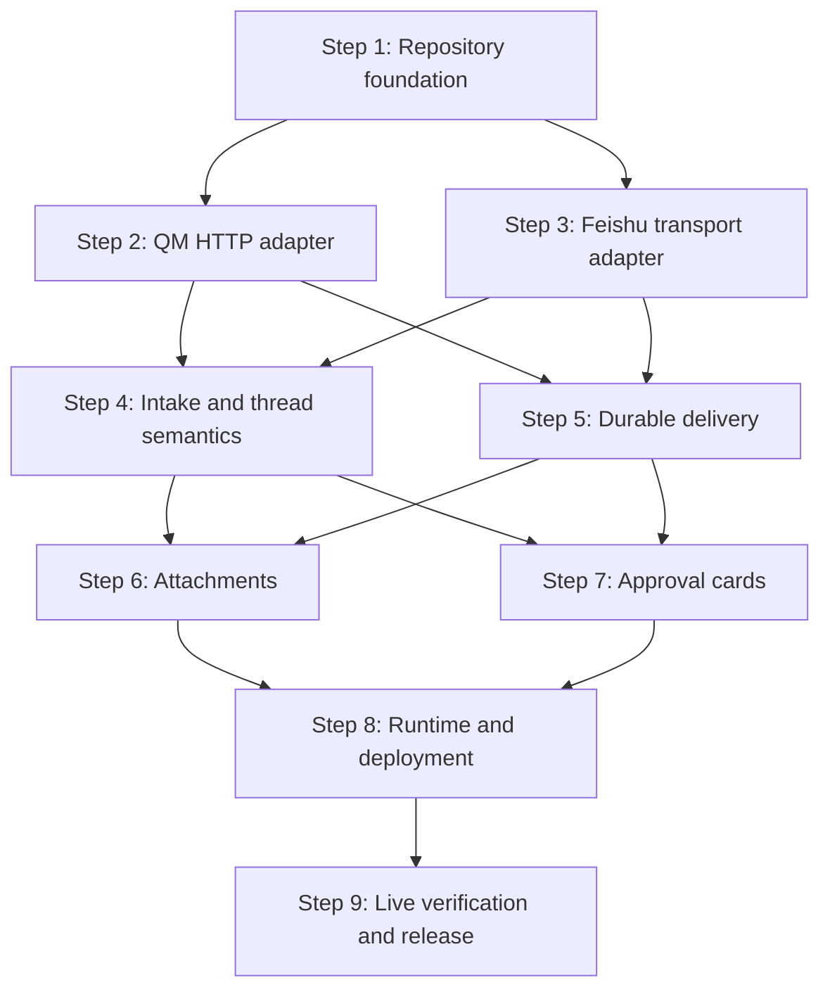

> 治理版本：2
> 事实状态：n/a
> 生命周期：historical
> 实施状态：completed
> SSOT 同步：synced
> 对应事实源：docs/01-architecture/project-architecture.md, docs/03-workflows/release-verification.md
> 替代关系：当前事实由架构与发布验证 SSOT 替代
> 最后复核时间：2026-08-06
> 归档原因：执行计划已完成，不再参与当前决策
> 原始路径：docs/plans/qm-feishu-20260803-surface-adapter.md
> 归档时间：2026-08-06

# qm-feishu Surface Adapter Implementation Plan

Date: 2026-08-03
Status: Ready for execution after review
Design: `docs/superpowers/specs/2026-08-03-qm-feishu-design.md`
Target repository: `github.com/luw2007/qm-feishu`
Reference QM revision: `yc-software/qm@7f2c916`

## Goal

Deliver a public, independently deployable Feishu/Lark message surface for QM. The adapter must reproduce the selected observable Slack behaviors through Feishu-native facilities while remaining source-isolated from QM.

## Principles

1. Migrate behavior, not Slack implementation.
2. Keep QM authoritative for runs, approvals, and deliveries.
3. Cross the QM seam only through signed HTTP.
4. Make retries idempotent before adding richer presentation.
5. Fail closed on identity, tenant, target, and approval uncertainty.

## Decision Drivers

1. Independent versioning and deployment from QM core.
2. Correct durable behavior under duplicate events and partial delivery failures.
3. A small public interface that remains maintainable as QM and Feishu evolve.

## Options Considered

### Independent HTTP adapter

Chosen. It provides source isolation, independent releases, realistic contract testing, and a replaceable transport when QM publishes a formal plugin SDK.

### Vendored QM chassis

Rejected. `plugins/chassis` is private, unpublished, and consumed by relative source imports. Vendoring creates an undeclared synchronization protocol and weakens the isolation guarantee.

### QM fork, submodule, or workspace integration

Rejected. It couples releases, imports Slack-specific assumptions, and fails the explicit requirement to isolate QM core code.

## Dependency Graph



Steps 2 and 3 may execute in parallel after Step 1. Steps 6 and 7 may execute in parallel after their prerequisites.

## Cross-Step Contracts

### Stable port interfaces

Step 1 defines `QmPort` and `FeishuPort`. Later steps may extend value types but must not expose SDK clients, HTTP responses, or vendor errors through these ports.

### Stable identifier grammar

```text
threadRef
  feishu:dm:<chat_id>
  feishu:chat:<chat_id>:message:<root_message_id>

delivery target
  chat:<chat_id>:message:<root_message_id>
  user:<open_id>
```

No step may introduce a second grammar or reuse Slack timestamp encoding.

### Idempotency

```text
inbound turn: feishu:message:<message_id>
approval action: feishu:approval:<request_id>:<action>:<event_id>
outbound part: hash(<qm delivery key>, <part index>, <part kind>) truncated to <= 50 chars
```

QM `7f2c916` returns an already-completed idempotency replay as `{ status: "ok", ... }` rather than a queued run. `QmPort.submitTurn` maps that narrow wire response to `{ replayed: true }`; surface handlers suppress duplicate acknowledgements, cache publication, and approval watchers instead of inventing a run ID.

### Error ownership

- transport modules classify external errors;
- surface modules decide retry, rejection, and acknowledgement;
- runtime logs outcomes and coordinates shutdown;
- QM retains authoritative durable workflow state.

## Step 1: Repository Foundation and Isolation Gates

### Context

Start from the approved design. This repository must remain operable without `~/ai/qm` present. QM currently uses Node 24 and TypeScript directly, but `qm-feishu` owns its build and release choices.

### Files

Create:

```text
package.json
package-lock.json
tsconfig.json
eslint.config.js
.gitignore
LICENSE
README.md
SECURITY.md
src/index.ts
src/config.ts
src/runtime.ts
src/types.ts
src/ports.ts
test/isolation.test.ts
.github/workflows/ci.yml
```

### Work

1. Configure Node `>=24`, ESM, TypeScript, Node test runner, lint, typecheck, and coverage commands.
2. Add only the official Feishu Node SDK and the smallest runtime-schema dependency justified by the QM contract validator. Prefer no runtime-schema dependency if explicit narrow parsers remain clear.
3. Define `FeishuSurfaceConfig`, `QmPort`, `FeishuPort`, normalized messages, targets, receipts, deliveries, approvals, actors, and run views.
4. Export only `startFeishuSurface` and public configuration/types from `src/index.ts`.
5. Add lint/import rules enforcing the design's module restrictions.
6. Add a repository scan test that fails on QM source imports, Git dependencies on QM, local checkout paths, and non-synthetic identifiers in fixtures.
7. Document required environment variables, supported scope, explicit non-goals, local dual-repository topology, and compatibility policy.
8. Add MIT and private vulnerability reporting guidance.

### Verification

Run:

```text
npm install
npm run typecheck
npm run lint
npm test
```

Verify isolation non-destructively from a clean temporary clone of `qm-feishu`; never rename, remove, or modify the sibling `~/ai/qm` checkout. Run install, typecheck, lint, and tests in that clone.

### Exit criteria

- the package exposes one runtime entrypoint;
- prohibited imports fail automatically;
- no QM source checkout is needed;
- CI runs typecheck, lint, and tests on Node 24;
- secrets and tenant data are ignored.

### Rollback

Delete the unimplemented scaffold. No runtime or remote system has changed.

## Step 2: Source-Authenticated QM HTTP Adapter

### Context

QM reference contracts are implemented in:

- `../qm/src/auth/source-auth-sign.ts` for current signing behavior;
- `../qm/src/api/routes/turns.ts` for turn, run, delivery, and approval routes;
- `../qm/src/api/routes/blobs.ts` for blob transfer;
- `../qm/src/api/routes/directory.ts` for directory publication;
- `../qm/src/api/routes/surface-cache.ts` for surface-cache ingestion;
- `../qm/src/types.ts` for current request shapes.

Read these only as protocol evidence. Do not copy modules or import them.

### QM contract environment

Contract tests target a separately started local QM checkout. Use a 32-or-more-character signing secret, a dedicated data directory, the local transfer store, and synchronized system clocks:

```text
cd ../qm
env CORE_SIGNING_SECRET=qm-feishu-contract-secret-00000001 PORT=18080 DATA_DIR=/tmp/qm-feishu-contract TRANSFER_STORE=local npm start
```

Set `QM_CONTRACT_BASE_URL=http://127.0.0.1:18080` and the same value as `QM_CONTRACT_SIGNING_SECRET` in the qm-feishu test process. Local transfer storage is wired by default under `DATA_DIR`; tests requiring completed model runs or generated approvals also require the normal QM model credentials documented by QM. Source-auth timestamps must remain within QM's five-minute replay window. When `QM_CONTRACT_BASE_URL` is unset, the contract suite reports an explicit skip locally; compatibility and release CI must provide it and treats any skip as failure.

### Files

Create:

```text
src/qm/source-auth.ts
src/qm/contracts.ts
src/qm/client.ts
test/qm/source-auth.test.ts
test/qm/contracts.test.ts
test/qm/client.test.ts
test/qm/contract.integration.test.ts
```

### Work

1. Implement the source-auth signing algorithm from the observed HTTP protocol in one local module.
2. Build a narrow fetch-based `QmHttpClient` implementing `QmPort`.
3. Implement explicit request construction for async turns, active run lookup, run read/signal, delivery claim/ack/ack-by-key, pending approval by thread, approval read, blob upload/read, file-artifact read, directory push, and surface-cache ingest.
4. Implement raw blob upload with `x-content-sha256`; sign the hexadecimal digest as the canonical payload tail rather than signing the binary body.
5. Parse every response at runtime and reject malformed successful responses.
6. Distinguish authentication, terminal refusal/other permanent 4xx, transient 429/5xx, timeout, and network failures.
7. Ensure URL query values and path identifiers are encoded exactly once.
8. Pin run signals to the literal `abort | steer` union and never populate QM's Slack-specific metric fields.
9. Add a contract harness configurable with `QM_CONTRACT_BASE_URL` and `QM_CONTRACT_SIGNING_SECRET`.
10. Record the tested QM revision in package metadata or a machine-readable compatibility file.

### Verification

Against local QM:

```text
npm run test:qm-contract
```

The suite must prove:

- signed requests authenticate;
- an async `surface=feishu` turn returns a queued response;
- actor, thread, and delivery target survive submission;
- `type=feishu` deliveries can be claimed and acknowledged;
- a blob can be uploaded, a blob can be read, and a file artifact can be read with its required viewer identity;
- pending approval lookup by thread returns the current approval and exposes `request?.actor.externalId` when QM retained the originating request;
- approval reads and continuations preserve actor visibility rules.

### Exit criteria

- `QmHttpClient` satisfies `QmPort` without QM imports;
- malformed 2xx bodies fail loudly;
- contract tests identify the exact QM revision;
- no Slack metric or identity field receives Feishu data.

### Rollback

Remove `src/qm/` and its tests. No QM schema or data migration is involved.

## Step 3: Feishu Transport Adapter

### Context

Use the official Feishu Node SDK and current official documentation for:

- `im.message.receive_v1`;
- long-connection event subscription;
- reply and send message APIs;
- `card.action.trigger`;
- file/image upload and download;
- tenant tokens and rate limits.

Do not encode QM decisions in this module.

### Files

Create:

```text
src/feishu/client.ts
src/feishu/events.ts
src/feishu/messages.ts
src/feishu/cards.ts
src/feishu/files.ts
src/feishu/directory.ts
test/feishu/events.test.ts
test/feishu/messages.test.ts
test/feishu/cards.test.ts
test/feishu/files.test.ts
test/fixtures/feishu/*.json
```

### Work

1. Wrap the SDK behind `FeishuPort` and a small event-source interface.
2. Decode only required event and callback fields; reject malformed bodies explicitly.
3. Normalize Feishu error codes into permanent, transient, rate-limited, and unavailable classes.
4. Implement reply, proactive send, message update, file download, and file/image upload.
5. Pass a caller-supplied idempotency UUID to every supported outbound message operation.
6. Enforce the documented 30 MB file limit before upload.
7. Represent card callback operators only by verified callback fields; do not accept operator IDs from card values.
8. Keep tenant tokens and secrets out of errors and logs.
9. Use synthetic official-shape fixtures only.

### Verification

Run mocked transport tests that verify exact requests and cover:

- direct and group receive events;
- topic identifiers;
- text, rich post, image, and file decoding;
- reply-in-thread behavior;
- proactive send by `open_id`;
- card callback decoding;
- 429 with retry metadata;
- 5xx and network failure;
- oversized and empty files.

### Exit criteria

- the SDK is absent from surface-module imports;
- the Feishu adapter satisfies `FeishuPort`;
- all external errors are classified;
- no credential or message body appears in default logs.

### Rollback

Remove `src/feishu/` and its tests. No QM contract changes exist.

## Step 4: Intake, Identity, and Thread Semantics

### Context

This is the behavioral migration layer. Slack's current observable behavior can be inspected in `../qm/src/slack/events.ts` and `../qm/src/slack/turn-handler.ts`, but no Slack utility or event shape may enter this repository.

### Files

Create:

```text
src/surface/threads.ts
src/surface/intake.ts
test/surface/threads.test.ts
test/surface/intake.test.ts
```

### Work

1. Implement strict parse/render functions for the approved thread and destination grammar.
2. Map Feishu `open_id` to QM actor `externalId` without email guessing.
3. Accept all valid direct messages and only explicitly mentioned group messages.
4. Ignore the current application's own messages.
5. Convert supported text and rich-post content into a normalized turn.
6. Set `surface="feishu"`, `addressed=true`, `surfaceTools=false`, the stable thread reference, channel reference/name when known, human origin, trigger timestamp, delivery target, display text, and deterministic idempotency key.
7. Detect only explicit stop inputs before submission and signal an active run with `{ kind: "abort" }`. Submit ordinary follow-ups normally; QM already folds a normal asynchronous turn into an active run and returns `steered=true`.
8. Submit the turn asynchronously; post acknowledgement only after QM accepts it. Treat a QM 403 as a terminal refused result, not an infrastructure retry.
9. Publish normalized surface events after turn acceptance with Feishu `message_id` mapped to the required cache `ts` field. Surface-cache failure is observable but does not roll back the accepted turn.
10. Return the queued `runId` and `threadRef` to the approval watcher introduced in Step 7.
11. Fail closed for external tenant, missing sender identity, unsupported encrypted chat, or ambiguous bot mention.

### Verification

Tests must prove:

- direct messages map to `feishu:dm:<chat_id>`;
- non-topic group mentions root at the triggering `message_id`;
- topic replies root at `root_id`;
- unmentioned group messages and self messages produce no turn;
- duplicate `message_id` values reuse the same idempotency key;
- a stop request signals the active run rather than enqueueing a second run;
- acknowledgement occurs after QM acceptance;
- surface-cache failure does not resubmit or erase the turn.

### Exit criteria

- text DM and group mention flows pass through fake ports;
- no vendor client or HTTP response escapes into the surface module;
- all identity uncertainty fails closed.

### Rollback

Disable event registration for intake. Transport modules remain independently testable.

## Step 5: Durable Delivery and Rate-Limited Sending

### Context

QM surface deliveries are authoritative and leased through `GET /v1/deliveries?type=feishu&claimMs=...`. Principal deliveries use `type=principal`; qm-feishu may claim them only in an explicitly configured single-principal-surface deployment. A send is complete only after Feishu confirms every required message part and QM accepts the delivery acknowledgement.

### Files

Create:

```text
src/surface/deliveries.ts
src/surface/keyed-queue.ts
test/surface/deliveries.test.ts
test/surface/keyed-queue.test.ts
```

### Work

1. Always poll and claim `type=feishu` deliveries.
2. Poll `type=principal` only when `FEISHU_CLAIM_PRINCIPAL_DELIVERIES=1`. Setting this flag is the operator's explicit declaration that qm-feishu is the deployment's sole principal-delivery consumer; mixed Slack-and-Feishu principal consumers are unsupported because QM has no atomic surface arbitration.
3. Parse targets strictly. For malformed, shadow, or well-formed but permanently unsupported deliveries, make no Feishu call, emit a structured terminal-disposition log, and acknowledge the delivery so it is not reclaimed forever.
4. Serialize external sends per `chat_id` or `open_id`.
5. Render long text into deterministic Feishu-sized parts without changing part boundaries across retries.
6. Derive stable UUIDs for each sent message part.
7. Reply to a message-chain target and, when principal claiming is enabled, proactively send to a principal target.
8. Acknowledge QM only after all required message parts succeed. If the Feishu send succeeded but acknowledgement failed, recover with the delivery idempotency key through `/v1/deliveries/ack-by-key`.
9. Return the direct-message `threadRef` for successful principal delivery.
10. Classify permanent and transient errors. Retryable failures remain unacknowledged and become claimable only after the existing lease expires; QM has no active lease-release route.
11. Prevent an in-process poller from concurrently processing the same claimed delivery.
12. Coordinate shutdown by stopping new claims and awaiting active sends up to a configured timeout.

### Verification

Tests must prove:

- duplicate poll ticks do not concurrently send one delivery;
- same-destination deliveries are ordered;
- different destinations can progress independently;
- transient failure leaves a delivery unacknowledged;
- retry uses the same UUID and message-part boundaries;
- every required part must succeed before acknowledgement;
- principal delivery records the resolved DM thread;
- shadow and permanently unsupported deliveries are acknowledged without a Feishu call;
- principal claims remain off by default and tests confirm the flag is the explicit single-consumer declaration;
- a lost acknowledgement is recovered by idempotency key;
- shutdown stops claims and drains bounded in-flight work.

### Exit criteria

- durable text delivery works with fake ports and the QM contract environment;
- retries do not duplicate confirmed Feishu parts;
- destination rate limits are respected by construction.

### Rollback

Stop the delivery poller. Unacknowledged deliveries remain durable in QM.

## Step 6: Bidirectional Attachments

### Context

Incoming resources become QM blobs before turn submission. Outgoing QM attachments are downloaded from QM, uploaded to Feishu, and posted as deterministic delivery parts. Feishu's documented upload maximum is 30 MB.

### Files

Modify:

```text
src/surface/intake.ts
src/surface/deliveries.ts
src/qm/client.ts
src/feishu/files.ts
```

Create:

```text
test/surface/attachments.test.ts
```

### Work

1. Support incoming image and file messages defined in the design.
2. Buffer each incoming file once up to the 30 MB Feishu ceiling, compute its SHA-256 digest, then stream that buffer to QM with the digest header. The 30 MB ceiling is the explicit memory bound required by QM's signed raw upload contract.
3. Reject empty, oversized, or unsupported resources before QM turn submission.
4. Preserve filename, media type, and size in normalized attachment metadata.
5. Fetch outgoing QM blobs/artifacts through the narrow QM client.
6. Upload each outgoing attachment and send the returned resource key with the deterministic UUID for that message part. Feishu uploads may repeat after failure; the message send is the idempotent boundary.
7. Leave delivery unacknowledged when any required attachment fails.
8. Produce a stable user-visible failure only for permanent attachment errors; transient failures remain retriable.

### Verification

Cover:

- image and generic file input;
- filename and media metadata preservation;
- 0-byte and >30 MB rejection;
- text success followed by attachment retry without duplicate text;
- multiple attachments with stable order and UUIDs;
- stream failure cleanup.

### Exit criteria

- supported files work in both directions;
- memory usage is bounded by configured/file limits;
- partial failure cannot falsely acknowledge the delivery.

### Rollback

Disable attachment message types while preserving text behavior. Pending attachment deliveries remain retryable.

## Step 7: Approval Cards and Actor Verification

### Context

QM owns approval state. Feishu cards are presentation and input only. A callback cannot authorize work from its embedded value; the adapter must reload the approval and derive actor identity from `operator.open_id`.

### Files

Create:

```text
src/surface/approvals.ts
test/surface/approvals.test.ts
```

Modify:

```text
src/feishu/cards.ts
src/surface/intake.ts
```

### Work

1. For each accepted queued run, poll QM's pending-approval-by-thread route until the run becomes terminal or an approval appears; pending approvals are not normal durable deliveries.
2. Render pending approvals as cards with allow-once, allow-session, allow-always, and deny actions only when QM grants those modes.
3. Bind only request ID and action to the card. Authenticity comes from verified Feishu callbacks and server-side approval reload, not card values or adapter-local nonce state.
4. Return the Feishu callback response within three seconds before waiting for an agent run.
5. Reload the current approval from QM.
6. Compare `operator.open_id` with `record.request?.actor.externalId`. If `request`, `actor`, or `externalId` is absent, deny and return a cannot-verify-requester toast.
7. Submit an asynchronous continuation turn containing `{ requestId, approved, scope }`.
8. Deduplicate event IDs and request-action combinations through QM turn idempotency.
9. Update the card or return a toast for accepted, denied, stale, unavailable, unverifiable, and actor-mismatch outcomes.
10. Log identifiers and outcome classes without logging commands or secrets by default.

### Verification

Tests must prove:

- card values contain no actor or command authority;
- actor mismatch, absent originating request, stale request, missing request, and malformed action never continue approval;
- a queued run with a pending approval causes exactly one card;
- repeated callbacks produce one effective continuation;
- callback acknowledgement precedes QM completion;
- allowed scopes map exactly;
- deny never carries an approval scope.

### Exit criteria

- allow and deny flows work through fake ports and QM contract tests;
- forged callbacks fail closed;
- callback response latency is independent of run duration.

### Rollback

Disable card action registration. QM approvals remain pending and can be handled through another surface.

## Step 8: Runtime, Configuration, Container, and Observability

### Context

The runtime composes the two adapters and surface orchestrators. It must remain a separate process with clean startup, readiness, and shutdown semantics.

### Files

Modify:

```text
src/config.ts
src/runtime.ts
src/index.ts
README.md
SECURITY.md
```

Create:

```text
src/logging.ts
src/health.ts
test/runtime.test.ts
test/config.test.ts
Dockerfile
.dockerignore
.github/workflows/container.yml
```

### Work

1. Parse and validate all required configuration before opening connections.
2. Compose `QmHttpClient`, `FeishuSdkClient`, intake, delivery, and approval modules.
3. Establish Feishu connection only after QM compatibility/authentication probe succeeds.
4. Expose liveness and readiness endpoints without secrets or tenant data.
5. Mark readiness false when mandatory QM or Feishu connectivity is unavailable.
6. Implement structured logs with correlation identifiers and default content redaction.
7. Emit delivery backlog, lease-reclaim count, terminal-disposition count, and approval-watcher outcome metrics so unsupported or stolen deliveries are observable.
8. Gracefully stop event intake, approval watchers, delivery claims, active sends, health server, and SDK connection.
9. Build a non-root minimal Node 24 container with no QM source copied into it.
10. Document the exact Feishu app capabilities, events, callbacks, scopes, availability range, and test-tenant setup.
11. Document deployment as an independent service next to QM using `CORE_API_URL` and `CORE_SIGNING_SECRET`, including the single-principal-consumer rule.

### Verification

Run:

```text
npm run typecheck
npm run lint
npm test
npm run build
```

Build and start the container. Exercise liveness, readiness, invalid configuration, unavailable QM, signal shutdown, and image inspection proving that QM source is absent.

### Exit criteria

- one command starts the adapter;
- readiness reflects real dependencies;
- shutdown is bounded and loss-safe;
- the public image contains no source checkout, secrets, or test payloads.

### Rollback

Stop or remove the independent adapter service. QM core remains unchanged.

## Step 9: Live Verification, Security Review, and `0.1.0`

### Context

Use a dedicated non-production Feishu tenant and test users. Do not record or commit production identifiers or payloads.

### Files

Create or update:

```text
docs/compatibility.md
docs/live-test-runbook.md
README.md
package.json
.github/workflows/release.yml
```

### Work

1. Run the full static, unit, fake-port, mocked OpenAPI, and QM contract suites.
2. Perform the live smoke matrix:
   - direct text message;
   - group mention;
   - non-mentioned group message ignored;
   - topic follow-up;
   - stop/steer during active run;
   - incoming and outgoing file;
   - allow-once and deny approval;
   - absent approval request rejected;
   - non-requester approval click rejected;
   - proactive principal delivery;
   - duplicate event replay;
   - transient Feishu send failure and recovery.
3. Capture only redacted evidence; never commit raw event payloads.
4. Run an independent security review focused on source-auth signing, callback forgery, identity confusion, tenant isolation, secret logging, and delivery acknowledgement.
5. Run an independent code review focused on missed Slack behavioral contracts, durability, retries, shutdown, and public maintainability.
6. Resolve all blocking and high-severity findings.
7. Record the tested QM commit/tag, Node version, SDK version, scopes, and known limits.
8. Publish `ghcr.io/luw2007/qm-feishu:0.1.0` and a GitHub release after CI passes.
9. Publish npm only if the selected package name is available and the runtime library interface is intentionally supported; container release is sufficient otherwise.

### Verification

Evidence must include:

- CI URL and passing jobs;
- exact QM revision used by contract tests;
- live smoke checklist with timestamps and redacted message IDs;
- security-review verdict;
- code-review verdict;
- container digest;
- clean secret scan.

### Exit criteria

- every design acceptance criterion is satisfied;
- no high-severity review finding remains;
- release artifacts identify their compatibility envelope;
- public history contains no tenant or organization-specific data.

### Rollback

Withdraw the pre-1.0 release and container tag if necessary. Stopping the adapter removes the Feishu surface without changing QM core.

## Verification Matrix

| Contract | Unit | Fake ports | QM integration | Mock Feishu | Live tenant |
|---|---:|---:|---:|---:|---:|
| Direct message turn | Yes | Yes | Yes | Yes | Yes |
| Group mention gating | Yes | Yes | Yes | Yes | Yes |
| Topic continuity | Yes | Yes | Yes | Yes | Yes |
| Stop/steer | Yes | Yes | Yes | No | Yes |
| Inbound dedupe | Yes | Yes | Yes | Yes | Yes |
| Durable delivery | Yes | Yes | Yes | Yes | Yes |
| Rate limiting | Yes | Yes | No | Yes | Targeted |
| Attachments | Yes | Yes | Yes | Yes | Yes |
| Approval identity | Yes | Yes | Yes | Yes | Yes |
| Graceful shutdown | Yes | Yes | No | No | Targeted |
| Source isolation | Yes | No | CI clean checkout | No | No |

## Risks and Mitigations

| Risk | Mitigation | Detection |
|---|---|---|
| QM HTTP contract changes silently | Runtime parsers and revision-pinned contract suite | Compatibility CI fails |
| Duplicate Feishu event creates duplicate work | QM turn idempotency from `message_id` | Replay tests and run count |
| Partial delivery duplicates text | Stable per-part UUID and deterministic splitting | Failure-injection tests |
| Approval callback is forged | Reload approval and match `operator.open_id` | Adversarial callback tests |
| Feishu identity is confused with Slack identity | Use `open_id` only as generic principal ID | Contract payload assertions |
| Adapter loses state on restart | QM remains authoritative; memory is only cache | Restart delivery tests |
| Rate limit stalls unrelated chats | Keyed per-destination serialization | Concurrent destination tests |
| Public repo leaks tenant data | Synthetic fixtures, redacted logs, secret scans | CI scan and release review |
| Long connection fails silently | Readiness and structured lifecycle logs | Health probe and fault test |
| Chassis signing logic diverges | One local signer plus live QM auth contract | Contract CI against supported QM |
| Unsupported or cross-surface delivery is reclaimed forever | Terminal disposition acknowledgement; principal claims off by default | Lease-reclaim and backlog metrics |

## Pre-Mortem

### Failure 1: The adapter works in tests but cannot authenticate after a QM update

Cause: source-auth behavior is treated as copied utility code rather than an external protocol. Prevention: keep signing isolated, validate against a real QM core on every compatibility update, and record the tested revision.

### Failure 2: A file delivery posts text repeatedly but never completes

Cause: retry granularity is whole-delivery while idempotency is only delivery-level. Prevention: deterministic message parts and stable Feishu UUID per part; inject failures between every part in tests.

### Failure 3: A different user approves another person's command

Cause: callback card values are trusted as identity. Prevention: identity comes only from the verified callback operator; the current approval is reloaded from QM; missing originating request or mismatch always fails closed.

## Plan Mutation Protocol

When execution reveals a contract mismatch:

1. record the observed QM revision, route, request, response, and failing acceptance criterion;
2. update this plan before changing the cross-step contract;
3. prefer adapting `src/qm/` without changing surface interfaces;
4. if QM lacks a required capability, create an organization-neutral upstream QM proposal rather than importing core code;
5. split a step when it exceeds one reviewable PR or introduces a new external seam;
6. never silently remove an acceptance criterion; mark it blocked with evidence and obtain an explicit scope decision.

## Commit and Review Strategy

Each numbered step is one logical branch/PR unless it remains small and reviewable with an adjacent prerequisite. Steps 2 and 3, then Steps 6 and 7, can be developed in parallel after their shared contracts are merged.

Every completed logical unit must pass its affected tests, typecheck, and lint before commit. Before merge, use an independent fresh-context reviewer. Security-sensitive steps 2, 5, and 7 require security review in addition to correctness review.

## Definition of Done

The project is complete when:

- it builds and tests in a clean checkout without QM source;
- every included behavior passes the verification matrix;
- live Feishu test-tenant evidence exists;
- QM contract compatibility is explicit and reproducible;
- source-auth and approval security reviews pass;
- no delivery is acknowledged before confirmed external completion;
- public artifacts contain no secrets or tenant data;
- `0.1.0` image and release notes are published with a compatibility declaration.
