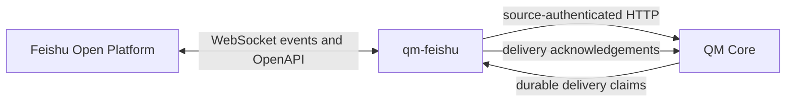

# qm-feishu Design

Date: 2026-08-03
Status: Approved for planning
Repository: `github.com/luw2007/qm-feishu`
QM reference: `yc-software/qm` at `7f2c916`

## Objective

Build an independently versioned Feishu/Lark message surface for QM. The adapter migrates Slack's observable QM-facing capabilities onto Feishu-native events, messages, topics, cards, and files without importing, vendoring, or modifying QM core source code.

## Decision

`qm-feishu` runs as a separate Node.js process and communicates with QM exclusively through source-authenticated HTTP routes. Slack is an acceptance oracle, not a source-code dependency.

The adapter implements these observable capabilities:

- direct-message turns;
- group mentions;
- topic and reply-chain continuity;
- active-run stop and steer handling;
- input and output attachments;
- immediate acknowledgement and durable final delivery;
- proactive principal delivery;
- command approval cards;
- identity and surface-cache publication;
- inbound and outbound idempotency.

It does not copy Slack Bolt handlers, Block Kit payloads, mrkdwn conversion, reaction semantics, Slack timestamp encodings, workspace synchronization, or token configuration.

## Product Boundary

`qm-feishu` is a QM message-surface adapter. It is not a general Feishu connector.

### Included in the first public release

| Capability | Feishu implementation |
|---|---|
| Direct messages | `im.message.receive_v1` messages where `chat_type=p2p` |
| Group activation | Group messages that explicitly mention the current bot |
| Topic continuity | Stable mapping from `root_id`, `thread_id`, and `message_id` to a QM `threadRef` |
| Stop and steer | QM active-run lookup and run signal within the mapped thread |
| Incoming files | Feishu resource download followed by QM blob staging |
| Acknowledgement | Plain message or status card posted after durable turn acceptance |
| Final replies | Claimed QM deliveries rendered through Feishu reply/send APIs |
| Proactive direct messages | QM principal deliveries sent to a Feishu `open_id` |
| Approvals | Interactive cards and `card.action.trigger` callbacks |
| Surface cache | Normalized events posted with `surface=feishu` |
| Deduplication | Feishu `message_id` inbound and QM delivery key-derived UUID outbound |

### Excluded from the first public release

- reading every message in a group;
- full history search or Slack mirror parity;
- emoji or reaction-driven instructions;
- dynamic acknowledgement emoji selection;
- multiple bot posting identities;
- ephemeral replies;
- token-by-token streaming through repeated message edits;
- cross-tenant groups and external collaborators;
- user-token impersonation;
- Feishu Docs, Wiki, Base, Calendar, Task, or native Approval products;
- automatic cross-surface identity merging.

## Architecture



The runtime is a deep module with one external interface:

```ts
startFeishuSurface(config: FeishuSurfaceConfig): Promise<{ stop(): Promise<void> }>
```

Callers provide Feishu application credentials, QM connection credentials, and bounded runtime settings. The module hides Feishu token management, event decoding, retries, target parsing, topic mapping, approval restoration, attachment transfer, delivery claims, and shutdown coordination.

## Repository Layout

```text
qm-feishu/
  src/
    index.ts
    config.ts
    runtime.ts
    types.ts
    ports.ts
    qm/
      client.ts
      contracts.ts
      source-auth.ts
    feishu/
      client.ts
      events.ts
      messages.ts
      cards.ts
      files.ts
      directory.ts
    surface/
      intake.ts
      threads.ts
      deliveries.ts
      approvals.ts
  test/
    fixtures/
    intake.test.ts
    threads.test.ts
    deliveries.test.ts
    approvals.test.ts
    contract.test.ts
  docs/
    plans/
    superpowers/specs/
  package.json
  tsconfig.json
  eslint.config.js
  Dockerfile
  LICENSE
  README.md
  SECURITY.md
```

## Module Seams

### QM module

`src/qm/` is the only module that understands QM's HTTP interface.

Responsibilities:

- source-auth request signing;
- request and response types;
- runtime response validation;
- turn, run, delivery, approval, blob, directory, and surface-cache operations;
- QM compatibility probing;
- QM transport error classification.

It must not import QM source code, `plugins/chassis`, Git dependencies, or files outside this repository.

### Feishu module

`src/feishu/` is the only module that understands the Feishu SDK and OpenAPI.

Responsibilities:

- WebSocket lifecycle;
- event and callback decoding;
- tenant access-token use;
- message reply, send, and update operations;
- card rendering;
- file upload and download;
- Feishu error and rate-limit classification;
- vendor identifiers such as `open_id`, `chat_id`, and `message_id`.

### Surface module

`src/surface/` owns the Slack-to-Feishu behavioral migration.

Responsibilities:

- deciding which Feishu events become QM turns;
- mapping identities, conversations, threads, and delivery targets;
- preserving turn and delivery idempotency;
- coordinating acknowledgements and final replies;
- validating approval actors;
- deciding when a delivery is safe to acknowledge.

The surface module calls only injected ports. It does not call `fetch` or import the Feishu SDK.

```ts
interface QmPort {
  submitTurn(input: SurfaceTurn): Promise<QueuedRun>;
  getRun(runId: string): Promise<RunView>;
  activeRun(threadRef: string): Promise<string | undefined>;
  signalRun(runId: string, signal: { kind: "abort" | "steer"; text?: string }): Promise<void>;
  claimDeliveries(type: string, leaseMs: number): Promise<Delivery[]>;
  ackDelivery(id: string, receipt?: DeliveryReceipt): Promise<void>;
  ackDeliveryByKey(idempotencyKey: string): Promise<void>;
  pendingApproval(threadRef: string): Promise<ApprovalView | null>;
  getApproval(requestId: string): Promise<ApprovalView | null>;
  stageBlob(file: IncomingFile): Promise<BlobRef>;
  readBlob(blobId: string): Promise<ReadableStream>;
  readFileArtifact(artifactId: string, viewerId: string): Promise<ReadableStream>;
  pushDirectory(batch: DirectoryBatch): Promise<void>;
  ingestSurfaceEvents(events: SurfaceEvent[]): Promise<void>;
}

interface FeishuPort {
  reply(messageId: string, message: OutgoingMessage): Promise<MessageReceipt>;
  send(target: FeishuTarget, message: OutgoingMessage): Promise<MessageReceipt>;
  update(messageId: string, message: OutgoingMessage): Promise<void>;
  download(resource: IncomingResource): Promise<ReadableStream>;
  upload(file: OutgoingFile): Promise<FeishuResourceKey>;
}
```

Production adapters and deterministic test fakes satisfy both ports.

## Isolation Rules

CI enforces these invariants:

- `src/surface/**` cannot import `@larksuiteoapi/node-sdk`;
- `src/surface/**` cannot import concrete clients from `src/qm/` or `src/feishu/`;
- `src/qm/**` and `src/feishu/**` cannot import each other;
- no source file may import `@yc-software/qm/src/*`;
- no dependency may point to a local QM checkout or a QM Git URL;
- public fixtures use synthetic identifiers only;
- the adapter never treats in-memory caches, concurrency guards, or retry bookkeeping as authoritative run, approval, or delivery state.

## QM HTTP Contract

The adapter uses these source-authenticated routes:

| Operation | Route |
|---|---|
| Submit asynchronous turn | `POST /v1/turns?async=1` |
| Read a run | `GET /v1/runs/:id` |
| Find active run by thread | `GET /v1/runs?threadRef=...` |
| Signal stop or steer | `POST /v1/runs/:id/signal` |
| Claim Feishu deliveries | `GET /v1/deliveries?type=feishu&claimMs=...` |
| Acknowledge a delivery | `POST /v1/deliveries/:id/ack` |
| Recover a lost delivery acknowledgement | `POST /v1/deliveries/ack-by-key` |
| Read an approval | `GET /v1/approvals/:id` |
| Find pending approval by thread | `GET /v1/approvals/pending?threadRef=...` |
| Stage an incoming file | `POST /v1/blobs` |
| Read a staged blob | `GET /v1/blobs/:id` |
| Read a file artifact | `GET /v1/files/:id/content?viewer=...` |
| Publish directory rows | `POST /v1/directory` |
| Publish surface events | `POST /v1/surface-cache/ingest` |

`POST /v1/blobs` is a raw binary upload, not a JSON request. With source authentication enabled, the client sends `x-content-sha256`, signs that hexadecimal digest as the canonical payload tail, and streams the matching bytes as the body.

The contract is locally typed and runtime-validated. `qm-feishu` does not claim that these routes are a stable upstream SDK. Every release records the exact QM tag or commit validated by its contract suite.

### Known upstream-specific constraints

QM currently names delivery timing fields `slackApiMs` and `slackInflightMs`. The Feishu adapter does not populate those fields.

QM's directory route accepts a generic `principalId` and an optional `slackId`. Feishu users use their `open_id` as `principalId`; the adapter never writes an `open_id` into `slackId`.

## Identity and Target Grammar

```text
principalId
  <feishu open_id>

threadRef
  feishu:dm:<chat_id>
  feishu:chat:<chat_id>:message:<root_message_id>

delivery target
  chat:<chat_id>:message:<root_message_id>
  user:<open_id>
```

Rules:

- one Feishu direct-message chat maps to one continuous QM thread;
- a non-topic group mention uses the trigger `message_id` as the reply-chain root;
- a topic message uses `root_id` as its root;
- target parsing rejects unknown prefixes, empty identifiers, and extra segments;
- no Slack target or timestamp parser is reused;
- automatic identity merging by email is outside the adapter.

## Intake Flow

1. Receive `im.message.receive_v1` through the Feishu SDK.
2. Validate tenant, sender, message type, and chat type.
3. Ignore messages authored by the current application.
4. Accept direct messages; accept group messages only when they mention the bot.
5. Parse supported text, rich-post text, image, and file content.
6. Download supported attachments and stage them in QM.
7. Build the actor, conversation, `threadRef`, and delivery target.
8. Submit an asynchronous QM turn with `surface="feishu"` and `idempotencyKey="feishu:message:<message_id>"`.
9. Post an acknowledgement only after QM accepts the turn.
10. Publish the normalized event to QM's surface cache.

A surface-cache failure does not invalidate an already accepted turn. It produces a structured error with the Feishu message identifier.

## Delivery Flow

1. Claim `type=feishu` deliveries with a bounded lease.
2. Claim `type=principal` only when `FEISHU_CLAIM_PRINCIPAL_DELIVERIES=1` explicitly declares qm-feishu to be the deployment's sole principal-delivery consumer. Mixed Slack-and-Feishu principal delivery is unsupported because QM currently has no atomic surface arbitration.
3. Validate the destination grammar before any external call.
4. Render text and attachments into Feishu-native messages.
5. Derive a Feishu UUID of at most 50 characters from the QM idempotency key and each sent message part.
6. Serialize sends per destination to respect the per-chat rate limit.
7. Acknowledge the QM delivery only after every required message part succeeds.
8. For principal delivery, return the resolved direct-message thread reference in the acknowledgement.
9. Acknowledge shadow or permanently unsupported deliveries without a Feishu call and emit a structured terminal-disposition log; retryable failures remain unacknowledged until their lease expires.

If text succeeds and an attachment fails, the adapter does not acknowledge the delivery. A retry uses the same message-part UUIDs so the successful send is not duplicated. Feishu resource uploads themselves are not idempotent and may repeat; only the corresponding message send is deduplicated.

## Approval Flow

1. After submitting an asynchronous run, poll `GET /v1/approvals/pending?threadRef=...` while the run is active; a pending approval is not emitted as a normal durable delivery.
2. When QM reports a pending approval, render a Feishu interactive card.
3. Card callback values contain only the request ID and action. Authenticity comes from verified Feishu callbacks, not card values.
4. On `card.action.trigger`, derive the actor from `operator.open_id`.
5. Reload the approval from QM.
6. Compare the operator with `record.request?.actor.externalId`. If the request or actor is absent, deny with a cannot-verify-requester response.
7. Return a callback response within three seconds.
8. Continue the approval asynchronously through a new QM turn with an approval payload.
9. Deduplicate callbacks by action event ID and request-action key.

A forged, stale, actor-mismatched, or unverifiable callback never executes a command.

## Error and Retry Model

### Permanent input errors

Examples: malformed target, unsupported message type, external tenant, unknown sender, oversized attachment. Reject without retry or post a stable user-facing error when safe.

Well-formed but unsupported delivery features are terminally acknowledged without a Feishu call so they cannot be reclaimed forever.

### Feishu transient errors

Examples: network failure, HTTP 429, and 5xx. Honor `Retry-After`, serialize work by destination, and apply bounded exponential backoff.

### QM transient errors

Examples: network failure, 502, and 503. A QM 403 is a terminal refused turn and is never retried as infrastructure failure. Do not wait indefinitely inside the event handler. Preserve the Feishu message identifier in logs; Feishu's at-least-once delivery and QM's idempotency key make retries safe.

The adapter never acknowledges a QM delivery after an unconfirmed Feishu send.

## Configuration

Required:

```text
CORE_API_URL
CORE_SIGNING_SECRET
FEISHU_APP_ID
FEISHU_APP_SECRET
```

`CORE_SIGNING_SECRET` must contain at least 32 characters. `FEISHU_CLAIM_PRINCIPAL_DELIVERIES` defaults off and may be enabled only when qm-feishu is the sole principal-delivery consumer.

The first release submits turns with `addressed=true` and `surfaceTools=false`. It does not request Slack-style reaction or delete deliveries.

Optional settings have bounded defaults for delivery claim duration, poll interval, request timeout, retry count, and log level. Secrets are trimmed, never logged, and never written to repository files.

## Development Model

The repositories are siblings:

```text
~/ai/qm
~/ai/qm-feishu
```

They share no workspace, submodule, symlink, relative import, or lockfile.

Development sequence:

1. verify pure mappers and orchestrators against fake ports;
2. run the QM contract suite against a local QM core;
3. run mocked Feishu OpenAPI contract tests;
4. exercise the adapter in a non-production Feishu tenant;
5. record the validated QM and Feishu SDK versions in every release.

`main` remains releasable. Work uses short branches and reviewed pull requests. The container image is published as `ghcr.io/luw2007/qm-feishu`. The project uses semantic versions; `0.x` may track evolving QM HTTP contracts, while `1.0` requires a documented compatibility policy.

## Verification Strategy

### Unit contracts

- event-to-turn normalization;
- identity, thread, and target grammar;
- approval actor validation;
- retry classification;
- deterministic outbound UUID derivation.

### Orchestration with fake ports

- duplicate messages produce one effective QM turn;
- unmentioned group messages do not trigger;
- a delivery is acknowledged only after all required parts succeed;
- partial attachment failure leaves the delivery pending;
- card callbacks respond quickly and continue asynchronously;
- stale or mismatched approvals are denied.

### QM contract integration

- QM accepts source-auth signatures;
- asynchronous turns return a queued response;
- `surface=feishu`, thread, actor, and target survive the HTTP boundary;
- Feishu deliveries can be claimed and acknowledged;
- blobs can be staged;
- approvals can be continued.

### Feishu contract tests

- official synthetic event shapes decode correctly;
- reply, send, upload, and card callback payloads match expected OpenAPI forms;
- 429, 5xx, duplicate event, and duplicate callback behavior is deterministic.

### Live smoke test

- direct message;
- group mention;
- topic follow-up;
- input and output file;
- allow and deny approval;
- proactive durable delivery.

## Open-Source Safety

- MIT license;
- secret scanning and dependency updates enabled;
- `.env`, logs, payload captures, and tenant data ignored;
- logs exclude tokens, message bodies, and attachment contents by default;
- fixtures contain only `ou_test_*`, `oc_test_*`, and `om_test_*` identifiers;
- `SECURITY.md` requests private disclosure for signature bypass, callback forgery, and identity confusion;
- release review scans for organization domains, emails, identifiers, and internal URLs.

## Acceptance Criteria

The design is implemented when:

1. `qm-feishu` builds and tests without a QM source checkout present.
2. Static checks reject all prohibited QM source imports.
3. A synthetic direct message and group mention produce correctly mapped asynchronous QM turns.
4. Duplicate inbound events and retried outbound sends do not duplicate effective work.
5. Thread replies remain in the same QM conversation and Feishu topic.
6. Text and file deliveries remain pending until confirmed by Feishu.
7. Approval callbacks enforce requester identity and complete asynchronously.
8. The contract suite passes against the declared QM revision.
9. The live smoke matrix passes in a test Feishu tenant.
10. The public repository contains no tenant or organization-specific data.
